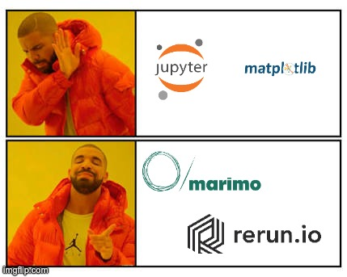
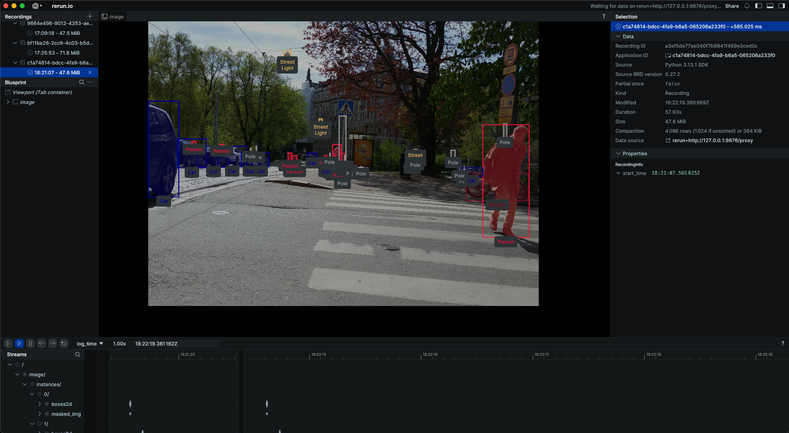

## Project overview

This project provides interactive, dynamic instance-visualization for the Mapillary Vistas Dataset using [marimo](https://marimo.io/) and [Rerun](https://rerun.io/). It combines static plots (via Matplotlib) with rich, real-time 2D/3D views in Rerun to support inspection and exploration of instance-level annotations. marimo is used as the primary, reactive notebook environment and app framework for running and interacting with the visualizations.




***

## Features

- Dynamic instance visualization for Mapillary Vistas images and annotations.
- Dual-output workflow: static Matplotlib figures plus interactive Rerun views.
- Reproducible, Python-first workflow using marimo notebooks stored as plain `.py` files.
- Dependency and environment management via `uv` for fast, isolated virtual environments.

***

## Prerequisites

- Python 3.10+ (recommended).
- Access to the Mapillary Vistas Dataset (requires registration and download from Mapillary).
- `uv` installed for environment management.
- `marimo`, `rerun-sdk`, `matplotlib`, and other dependencies specified in [pyproject.toml](pyproject.toml).

***

## 1. Install Mapillary Vistas

1. Request and download the Mapillary Vistas Dataset from the official website:  
   - https://www.mapillary.com/dataset/vistas  
2. Extract the dataset locally.
3. Update any dataset path variables in the project configuration or notebook (if applicable) to point to your local Vistas directory.

***

## 2. Environment setup with uv

`uv` is a small, fast CLI for creating/managing virtual environments and syncing dependencies from `pyproject.toml`.

### Install uv

- Preferred (isolated) installation via `pipx`:
  - `pipx install uv`
- Or user-local install via `pip`:
  - `pip install --user uv`

### Create the virtual environment

From the repository root:

```bash
cd /path/to/this/repo
uv venv .venv
```

### Activate the environment


- Standard activation:

    - macOS / Linux:

    ```bash
    source .venv/bin/activate
    ```

    - Windows PowerShell:

    ```powershell
    .venv\Scripts\Activate.ps1
    ```

### Sync dependencies

All dependencies are declared in `pyproject.toml`.

```bash
uv sync
```

This installs the pinned dependencies into `.venv`.

### Run the marimo app

You can either run through `uv` directly or activate the environment first.

- Directly via `uv`:

  ```bash
  uv run marimo edit main_marimo.py
  ```

- Or after activating the venv:

  ```bash
  source .venv/bin/activate
  uv run marimo edit main_marimo.py
  ```

This opens the marimo editor and launches the main notebook-based app.

***

## 3. Expected outputs

Running the main notebook will produce:

- **Matplotlib output**: static plots showing instance masks overlaid on images (e.g., bounding regions, colored masks).
  
  


  **Rerun output**: a dynamic visualization window (or web viewer) with interactive camera controls, timelines, and overlays for instances rendered as 2D/3D primitives.
  


Marimo keeps code and outputs in sync reactively, so editing a cell that affects data or visualization will automatically recompute dependent cells and refresh the outputs.

***

## Future work

- [ ] Add support for semantic segmentation visualization.
- [ ] Add support for panoptic segmentation visualization.
- [ ] Extend configuration to support multiple datasets and custom class mappings.
- [ ] Add example notebooks demonstrating common analysis workflows (e.g., class distribution, error analysis).

